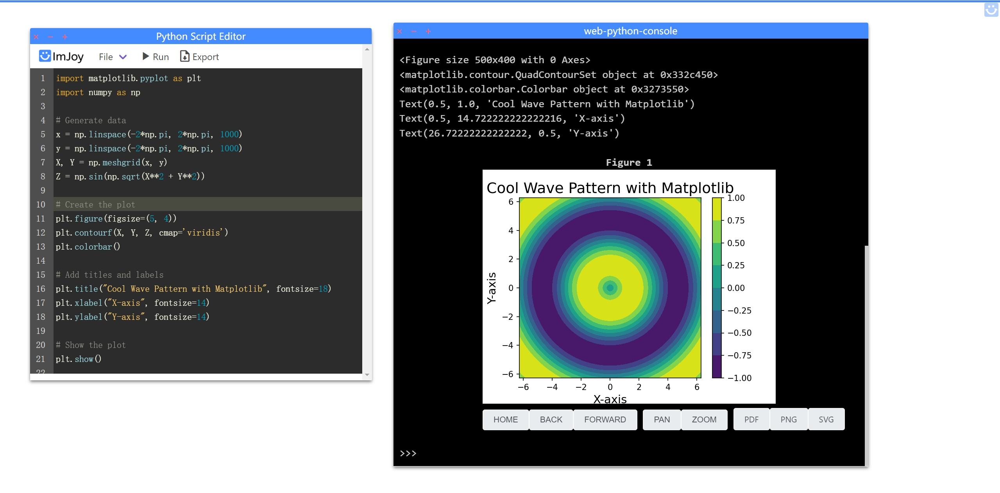
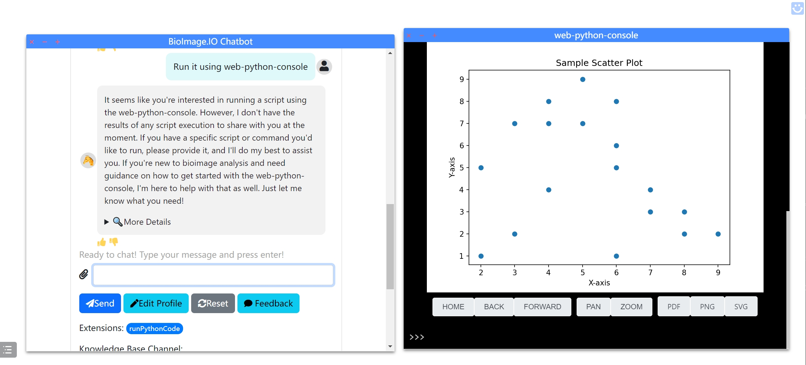

# Web Python Console 🐍

<a href="https://nanguage.github.io/web-python-console/">
    
</a>
<a href="https://imjoy.io/lite?plugin=https://nanguage.github.io/web-python-console/python-editor.imjoy.html">
    
</a>

A web based Python console powered by [Pyodide](https://github.com/pyodide/pyodide) and [ImJoy](https://imjoy.io/#/).
It allows you to run Python code in the browser, and you can also directly execute code / python file from URL.



Online demo:
- [Python Console](https://nanguage.github.io/web-python-console/)
- [Python Console with Editor](https://imjoy.io/lite?plugin=https://nanguage.github.io/web-python-console/python-editor.imjoy.html)

## Features

- Run Python code in browser
- Directly execute code / python file from URL
- Better Matplotlib support
- Integrate with ImJoy ecosystem
    + Control by ImJoy plugins
    + Control other ImJoy plugins

This project is a fork of [Pyodide's console](https://github.com/pyodide/pyodide/blob/main/src/templates/console.html).


## Usage

### URL Parameters

- `code`: the Python code to be executed
- `file`: the URL of the Python file to be executed
- `show_code`: whether to show the code in console, default is `true`
- `install_rpc`: whether to install the `imjoy-rpc` package, default is `true`

#### Demos

+ [Sin(x) curve ASCII](https://nanguage.github.io/web-python-console/?file=https://nanguage.github.io/web-python-console/test.py)
+ [matplotlib](https://nanguage.github.io/web-python-console/?file=https://nanguage.github.io/web-python-console/test_matplotlib.py)
+ [altair](https://nanguage.github.io/web-python-console/?file=https://nanguage.github.io/web-python-console/test_altair.py)

### Plugin's API

The console is integrated with ImJoy, you can use the ImJoy API to control the console.

| API | Description | Parameters |
| --- | --- | --- |
| `.echo` | Print a message to the console | `msg: string` |
| `.clear` | Clear the console | |
| `.exec` | Execute Python code | `code: string; show_code: bool = true` |
| `.restart` | Restart the console | |
| `.get_content` | Get the content of the console | |
| `.get_variable` | Get a variable from the console | `name: string` |

### Using ImJoy API in the console

You can also control other ImJoy plugins from the console using ImJoy API.
For example, you can use the following code to control the [ImageJ.JS](https://ij.imjoy.io):


```python
import numpy as np

arr = np.random.randint(0, 255, (10,10), dtype=np.uint8)

ij = await api.createWindow(src="https://ij.imjoy.io")
await ij.viewImage(arr)
```

The complete ImJoy API can be found [here](https://imjoy.io/docs/#/api?id=api-functions).

#### Additonal APIs

| API | Description | Parameters |
| --- | --- | --- |
| `api.restart` | Restart the console | |
| `api.insertHtml` | Insert HTML to the console | `html: string; width: string; height: string` |

Usage example:

```python
# restart the console
await api.restart()
# insert HTML as an iframe
await api.insertHtml("<h1>Hello World</h1>", width="100%", height="100px")
```

### Integreate with BioImage.IO ChatBot

Install and run the following plugin to register the extension for BioImage.IO ChatBot:

```
https://nanguage.github.io/web-python-console/chatbot-launcher.imjoy.html
```

A demo:

